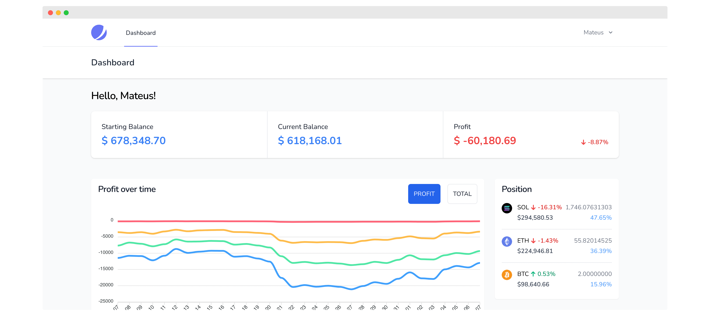

## Crypto Tracker

Crypto Tracker is a Laravel application meant to provide a single dashboard for your crypto (and in the future stocks) portfolio with data from multiple sources: exchanges, wallets, etc.   

If you wish to contribute, here is a list of cool stuff we need: https://github.com/mateusjatenee/wealth/issues/1

CT is a simple Laravel app and doesn't require much to run. The following should get you going:   

```
git clone https://github.com/mateusjatenee/crypto-tracker.git
cd crypto-tracker
composer install
cp .env.example .env
php artisan key:generate
php artisan migrate
```   

After you add your DB credentials, you can run `php artisan db:seed` to generate a test user: `test@test.com` / `password`.   
To load crypto assets, run `php artisan crypto-assets:load`  
To track crypto prices, run `php artisan coins:fetch-price`. The command will run indefinitely until you quit it (ctrl + C).   

Here's how half of the dashboard page looks like (values are not real, obviously. Otherwise I wouldn't be here 😂)

